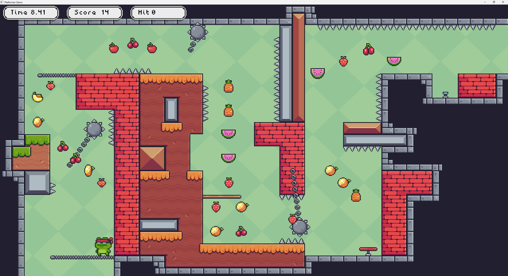

# Platformer Game



> Written in C# and uses Raylib as its back-end via NuGet.

A fast-paced, 2D, Platformer Game, where you traverse through each level as 
fast as possible, collecting as many fruits as the player can, with as few 
deaths as possible until you reach the end. Each run will be timed, allowing 
you to race yourself to achieve faster times and ideally collect all the 
fruits.

Each level will consist of multiple scenes loaded from an external level 
editor's JSON output 
([LDtk tile map and world editor v1.5.3](https://ldtk.io/download/)), in which 
the camera will switch to the centre position of the scene. Each level will be
constructed of actors similar to: Tile Map layer (ground), Fruit (collectables),
traps (Spikes, jump pads, etc) and basic platformer enemies.

## Building and Running

*Note: Release Mode removes access to the Testing Level, and shape collider
outlines when pressing F1*

> Debug Mode: ```dotnet run --project src/Platformer-Game```
>
> Release Mode: ```dotnet run --project src/Platformer-Game -c Release```

If you want to reset the save file, delete the SaveData.json file from the 
directory you ran the program

## Controls

### UI

### Debug Options

> Press F1 to reveal FPS. If built in Debug, then it will also show shape collider outlines

#### Moving between buttons

> Keyboard: WASD or Arrow keys
>
> Controller: D-pad buttons

#### Selecting a button

> Keyboard: Space or Enter
>
> Controller: down button (A: Xbox, X: PlayStation)

### Player

#### Horizontal Movement

> Keyboard: AD or Left & Right Arrow Keys
>
> Controller: Right joystick

#### Jump

> Keyboard: Space or W or Up Arrow Key
>
> Controller: down button (A: Xbox, X: PlayStation)

## Assets Used

* [Main Assets Pack](https://pixelfrog-assets.itch.io/pixel-adventure-1)
* [Enemy Asset Pack](https://pixelfrog-assets.itch.io/pixel-adventure-2)
* [Star Sprite](https://soulofkiran.itch.io/pixel-art-animated-star)
* [Fonts](https://not-jam.itch.io/not-jam-font-pack)
* [Prototype Tileset](https://captainlaptop.itch.io/white-prototyping-tileset)
* [Sound Effects](https://harvey656.itch.io/8-bit-game-sound-effects-collection)

## OOP Design patterns used

* Façade 
    * Application, AnimationController.
* Composite
    * World/Scene with their actors, Canvas, AnimationSet, CollisionShapes.
* Observer
    * EventDispatcher, Shape Colliders.
* Singleton
    * EventDispatcher.
* Flyweight
    * ResourceManager.
* Factory
    * CreateActorRegistry.
* Adapter
    * Sprite, SpriteAtlas, Window.
* State
    * Enemy.
* Probably more ...